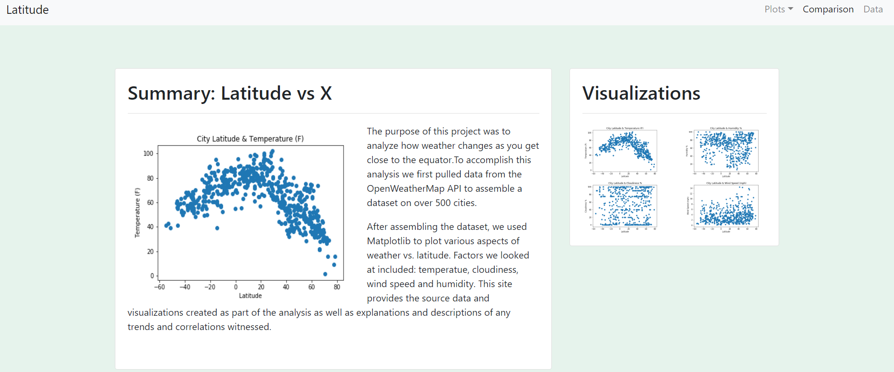
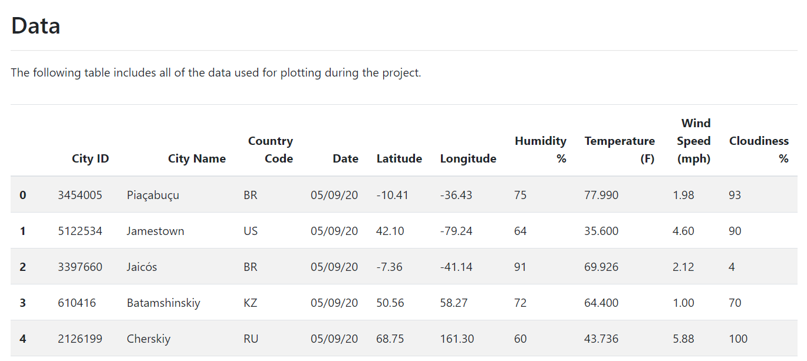
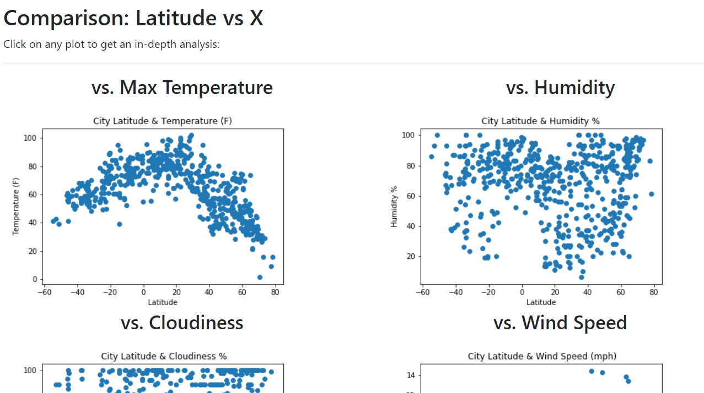

# Web Design Challenge

In this project a weather datadashboard was created using HTML and CSS.. The dashboard contains the following:

* A landing page containing  a brief explanation of the project, and the link to the visualizations page.
* A visualization page with:
  * A descriptive title and heading tag. 
  * The plot/visualization itself for the selected comparison.
  * A description of the plot and its significance.
* A "Comparisons" page that:
  * Contains all of the visualizations on the same page so they can be easily compared.
  * Bootstrap grid was used for the visualizations.
* A "Data" page that:
  * Displays a table containing the data used in the visualizations.

### Link: https://fabiola-c14.github.io/Web-Design-Challenge/

### Screenshot of pages:

### Landing Page

